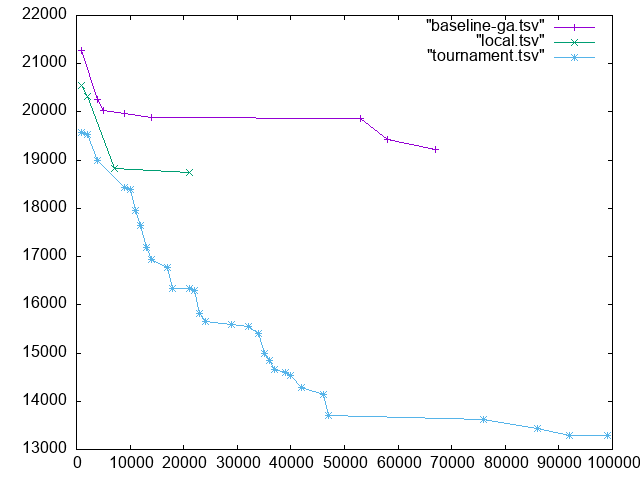

# HW 11: Advanced GA

## Overview

This is a continuation of the traveling salesperson problem that uses a more advanced GA search function.

## Testing

This repository contains `constant.hh` which sets a variable `verbose` to `false`. Go into this file and reset it to `true`, then uncomment any lines in the rest of the files that have an `if (verbose){}` statement to see more print statements. To disable, comment out the lines again or set `verbose` to be `false` again in `constant/hh`. Note that in order for this method to work, you must use `g++`.

Tests for `ClimbChromosome` and `TournamentDeme` classes are inlcluded in their implimentation (spelling?). The test files are for the Makefile.

## Running the code

The arguments needed are:
* `filename.tsv` *a file of city coordinates*
* `pop_size` *the population size*
* `mut_rate` *the mutation rate*
* `p` *the number of `Chromosome` objects in a `TournamentDeme` that will compete with each other*

*Note that `p` must be a power of 2* 

To run the code type:
	
	make -j
	./tsp filename.tsv pop_size mut_rate p >tournament.tsv

The ordering of shortest path as calculated by the advanced ga search will be saved in `tournament.tsv`. To test the results of the other algorithms, uncomment the lines 142 and 143 in `tsp.cc`.

## Results

The best orderings for `challenge.tsv` are in `shortest.tsv`. The speeds and distances are written to `tournament.tsv`. 

Below is a plot comparing the speeds of randomized search, basic ga, and advanced ga:

